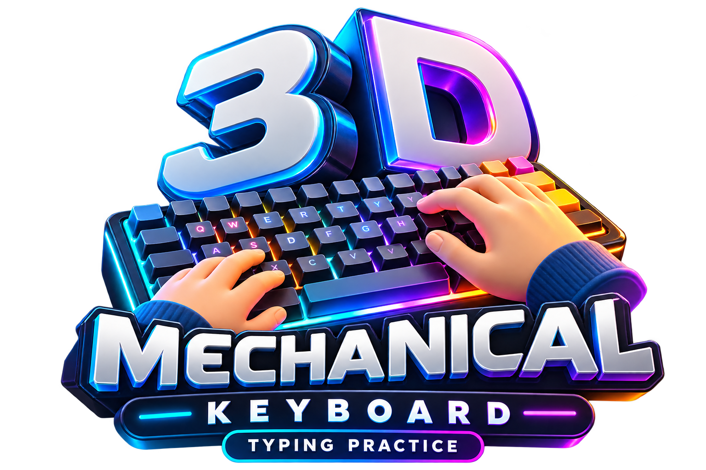

<div align="center">

  

  # ⌨️ 3D Mechanical Keyboard Studio & Touch-Typing Arcade

  <p align="center">
    <strong>A high-fidelity 3D mechanical keyboard simulator, acoustic synthesizer, and full-fledged typing arcade engineered in pure React, TypeScript, Tailwind CSS, and Web Audio API.</strong>
  </p>

  <p align="center">
    
    
    
    
    
    
  </p>
</div>

---

## 🌟 Key Highlights & Overview

The **3D Mechanical Keyboard Studio** is an interactive web platform designed for mechanical keyboard enthusiasts, touch-typists, and software engineers. It merges physical contact kinematics with zero-latency synthesized acoustics, an exploded scroll-driven 3D keyboard assembly, 7 challenging arcade games, Apple Liquid Glass specular glassmorphism, and real-time cloud analytics synchronization.

---

## 🚀 Core Features

### 🧩 1. Scroll-Driven 3D Exploded Keyboard Assembly
- **Layered Physical Disassembly**: Scroll through the interactive workbench to separate and inspect the keyboard layer by layer:
  - **Dye-Sub PBT Keycaps**: Sculpted OEM profile keycaps with dynamic per-key RGB glow.
  - **Mechanical Switches**: Realistic switch stems, springs, and contact leaves.
  - **FR4 Sound Plate**: Precision-cut mounting plate for structural acoustic resonance.
  - **Hot-Swap PCB**: Custom circuit board traces and per-switch hot-swap sockets.
  - **Poron Dampening Foam**: High-density acoustic absorption layer eliminating case ping.
  - **CNC Aluminum Chassis**: Weighted anodized enclosure with specular chamfered bevels.
- **Interactive Live Key Testing**: Click or type on any physical key on your hardware keyboard to see real-time 3D travel depth, hit tracking, and acoustic playback.

---

### 🎮 2. 7 Dedicated Touch-Typing Arcade Games & Drills

1. **🎓 Typing Academy**:
   - 16 structured touch-typing lessons progressing from home-row foundation keys to advanced punctuation and numeral matrices.
   - Real-time finger position heatmap guiding the exact finger assignment for every keystroke.
2. **⚡ Code Sprint**:
   - Real-world syntax typing challenges in **Python, JavaScript, TypeScript, Rust, Go, C++, and HTML/CSS**.
   - Accurately tracks syntax error hotspots, code completion speed (WPM), and elapsed time.
3. **🔥 Speed Arena (Live Speed Test)**:
   - Instant WPM benchmarking with randomized pangram phrases, net accuracy gauges, and celebratory particle confetti.
4. **☄️ Meteor Defense**:
   - Retro arcade shooter where falling meteors with words must be vaporized by typing before impacting planetary defenses.
5. **🙈 Blind Typing Challenge**:
   - Muscle-memory test that obscures active character prompts to build pure tactile touch-typing reflexes.
6. **🎵 Sound Matrix Synthesizer**:
   - Musical rhythm board where keystrokes trigger harmonic synthesizer notes and sound textures.
7. **🥋 Shortcuts Dojo**:
   - Developer hotkey trainer detecting multi-key combinations (`Ctrl+C`, `Ctrl+Shift+P`, `Alt+Tab`, `Windows+.`, etc.) in real time.

---

### 🔊 3. Acoustic Sound Engine & Mechanical Switch Profiles
- **Zero-Latency Web Audio API Synthesis**: Generates authentic switch bottom-out acoustics, stem sliders, and reset clicks.
- **Switch Profiles**: Linear Thock (Black/Red), Clicky Crisp (Blue/Green), and Tactile Bump (Brown/Panda).
- **Physical Key Travel Kinematics**: Keycaps react to physical keyboard input with 4px vertical travel, bottom-out shadow compression, and smooth spring reset.

---

### 🎧 4. Integrated Lo-Fi Chill Music Player
- **5 Studio Soundtrack Tracks**:
  1. *Sunlight on the Desk*
  2. *Steaming Mug, Grey Skies*
  3. *Afternoon on the Sill*
  4. *Notes on the Glass*
  5. *The Last Keystroke*
- **Fisher-Yates Smart Shuffle**: Guarantees every track is played at least once per cycle before reshuffling.
- **Apple Liquid Glass Specular Controls**: Floating pill player with progress indicator, track details, animated equalizer, and popover volume fader.
- **Smart Game Detection**: Automatically engages during gameplay sessions and softly pauses during idle exploration.

---

### 🎨 5. 7 Curated Theme Palettes & Color Customization
- **Predefined Aesthetics**:
  - 🏙️ **Studio Light**: Clean architectural slate with solar orange accents.
  - 🌆 **Cyberpunk Neon**: Obsidian chassis with electric magenta & laser cyan backlights.
  - 🥷 **Carbon Stealth Dark**: Matte graphite with safety orange indicators.
  - 💾 **Retro Classic 90s**: Vintage IBM Model M industrial beige and red accents.
  - 🍵 **Matcha & Cream**: Soothing earthy sage, ivory keycaps, and emerald modifiers.
  - ❄️ **Nordic Polar Frost**: Glacial Arctic cyan and iced ocean blue.
  - 🌸 **Sakura Blossom**: Cherry petal pastel with gold escape accents.
  - 🔮 **Lavender Mist**: Lilac chassis with royal purple and milk alphas.
- **Finger Color Zones**: Optional visual RGB guide tinting keys according to touch-typing finger zones.
- **Persistent User Palettes**: Themes and color zone preferences automatically sync to user profiles in the database.

---

### ✨ 6. Apple Liquid Glass Design System
- **Specular Refraction & Dispersion**: Layered backdrop blur (`blur(24px) saturate(180%)`), top-edge glass reflections (`inset 0 1.5px 1.5px rgba(255,255,255,0.75)`), and ambient color glows.
- **Responsive Pills & Bento Grids**: Sculpted pill controls, floating navigation header, and fluid bento layouts.

---

### 🗄️ 7. Database, Cloud Sync & Developer Analytics
- **Dual Cloud & Local Architecture**:
  - **Supabase Cloud Sync**: Real-time synchronization of student metrics, level completions, best WPMs, and theme preferences.
  - **Local Fallback Engine**: Seamless offline support via LocalStorage and Vite JSON database server.
- **PBKDF2-SHA512 Password Encryption**: Salted multi-iteration password security with zero plaintext storage.
- **Live Student Analytics Table (`data/students_progress_table.html`)**: Developer audit table with KPI cards, multi-level search, and instant CSV export (`data/students_summary.csv`).

---

## 🛠️ Tech Stack

| Technology | Purpose |
| :--- | :--- |
| **React 19** | Component framework and state reconciliation |
| **TypeScript 5.7** | Type safety, data modeling, and contract enforcement |
| **Vite 6** | Ultra-fast development server, HMR, and production bundler |
| **Tailwind CSS v4** | Utility styling and CSS variable theming |
| **Framer Motion 12** | Layout animations, spring transitions, and drawer physics |
| **Web Audio API** | Real-time procedural mechanical switch sound synthesis |
| **Supabase (PostgreSQL)** | Cloud database, student progression tracking, and session sync |
| **Canvas Confetti** | Reward particle animations on game completions |
| **Lucide React** | Modern iconography set |

---

## 📁 Project Structure

```
3D Mechanical Keyboard/
├── public/                     # Static media & soundtrack assets
│   ├── icon_logo.png           # Official brand logo & favicon
│   ├── Afternoon_on_the_Sill.mp3
│   ├── Notes_on_the_Glass.mp3
│   ├── Steaming_Mug_Grey_Skies.mp3
│   ├── Sunlight_on_the_Desk.mp3
│   └── The_Last_Keystroke.mp3
├── data/                       # Database schema & analytics reports
│   ├── supabase_schema.sql     # Supabase SQL schema & access policies
│   ├── users.json              # Local development user store
│   ├── students_summary.csv    # Exported analytics spreadsheet
│   └── students_progress_table.html # Live HTML progress table
├── src/
│   ├── components/ui/          # Reusable UI & Game components
│   │   ├── keyboard.tsx        # Interactive 3D mechanical keyboard
│   │   ├── ExplodedKeyboardScroll.tsx # Scroll-driven exploded assembly
│   │   ├── KeyboardGame.tsx    # Typing Academy engine
│   │   ├── CodeSprintGame.tsx  # Multi-language code sprint
│   │   ├── FallingWordsGame.tsx# Meteor defense shooter
│   │   ├── BlindTypingGame.tsx # Blind typing challenge
│   │   ├── SoundMatrixGame.tsx # Synthesizer rhythm matrix
│   │   ├── GamesHub.tsx        # Arcade launcher hub
│   │   ├── SwitchShowcase.tsx  # Apple Bento feature showcase
│   │   ├── ThemeSidebar.tsx    # Theme & color customization drawer
│   │   ├── MusicPlayer.tsx     # Apple Liquid Glass Lo-Fi player
│   │   ├── MotionBackground.tsx# Aurora background animations
│   │   └── ParallaxFloatingElements.tsx # Floating hero keycaps
│   ├── lib/
│   │   ├── bgMusic.ts          # Fisher-Yates smart shuffle Lo-Fi manager
│   │   ├── sound.ts            # Mechanical switch Web Audio engine
│   │   ├── db.ts               # Supabase + local database engine
│   │   ├── supabase.ts         # Supabase client initialization
│   │   └── themes.ts           # 7 curated keyboard theme definitions
│   ├── App.tsx                 # Root application controller & router
│   ├── index.css               # Apple Liquid Glass & keycap styles
│   └── main.tsx                # React root mount
├── vite.config.ts              # Vite configuration & dev server database API
├── package.json
└── README.md
```

---

## ⚡ Getting Started

### 1. Prerequisites
- **Node.js** (v18.0 or higher recommended)
- **npm** or **yarn** / **pnpm**

### 2. Installation
Clone the repository and install all dependencies:

```bash
git clone https://github.com/shashaank747/3D-Mechanical-Keyboard.git
cd "3D-Mechanical-Keyboard"
npm install
```

### 3. Environment Setup (Optional for Supabase Cloud Sync)
Create a `.env` file in the root directory:

```env
VITE_SUPABASE_URL=your_supabase_project_url
VITE_SUPABASE_ANON_KEY=your_supabase_anon_key
```

*(If no Supabase credentials are provided, the application gracefully defaults to local database storage).*

### 4. Run Development Server
```bash
npm run dev
```
Open [http://localhost:3000](http://localhost:3000) in your browser.

### 5. Production Build
```bash
npm run build
npm run preview
```

---

## 🗄️ Supabase Cloud Database Setup

To enable real-time cloud sync for user metrics and saved themes:
1. Create a project at [supabase.com](https://supabase.com).
2. Navigate to the **SQL Editor** in your Supabase Dashboard.
3. Copy and execute the contents of [`data/supabase_schema.sql`](data/supabase_schema.sql).
4. Add your project URL and Anon Key to `.env`.

---

## 👨‍💻 Authors & Credits

- **Creator & Lead Developer**: Shashaank Sajjanar
- **Pair Programming & Engineering**: Google DeepMind Antigravity

---

<div align="center">
  <sub>Engineered with precision for mechanical keyboard lovers worldwide. ⌨️✨</sub>
</div>
